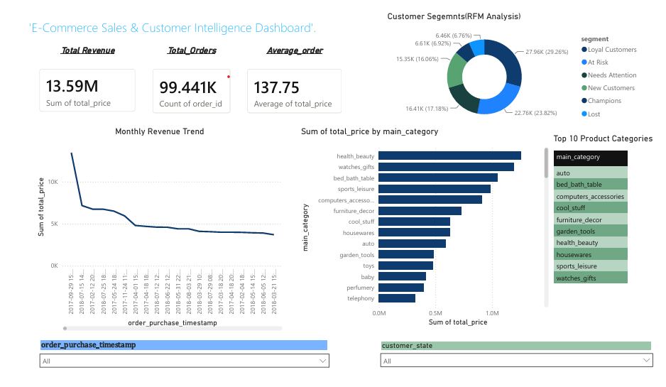

# E-Commerce Sales & Customer Intelligence Dashboard

## 📌 Overview
An end-to-end data analytics project analyzing 99,441 real e-commerce orders
(Olist Brazilian E-Commerce dataset) to uncover sales trends, segment
customers by value, and identify churn risk — delivered as an interactive
Power BI dashboard, backed by a PostgreSQL database and a full Python
analysis pipeline.

## ❓ Business Questions
1. What are the sales trends over time (monthly/seasonal patterns)?
2. Which product categories and regions generate the most revenue?
3. Who are the high-value customers, and who's at risk of churning?
4. What's driving delivery delays, and how do they relate to order volume?
5. How can customers be segmented into actionable marketing groups?

## 🛠 Tech Stack
- **Python** (pandas, numpy, matplotlib, seaborn) — data cleaning, EDA, RFM modeling
- **PostgreSQL** — relational database, loaded via SQLAlchemy
- **SQL** — aggregations, joins, window functions (`RANK() OVER`)
- **Power BI** — interactive dashboard with slicers and cross-filtering
- **Git/GitHub** — version control

## 📂 Project Structure
```
ecommerce-analytics-project/
├── dashboard/
│   ├── ecommerce_dashboard.pbix
│   └── dashboard_screenshot.png
├── data/
│   ├── raw/              # original Olist CSVs (not tracked in git)
│   └── processed/         # cleaned master table + RFM segments
├── notebooks/
│   ├── 01_data_cleaning_eda.ipynb
│   ├── 02_eda.ipynb
│   ├── 03_rfm_segmentation.ipynb
│   └── 04_sql_loading.ipynb
├── sql/
│   └── analysis_queries.sql

└── README.md
```

## 📊 Key Findings

- **Revenue grew consistently** from late 2016 through mid-2018, roughly
  20x-ing month over month in the first year, with a clear spike in
  November 2017 (Black Friday season).
- **Revenue is highly concentrated geographically**: São Paulo (SP) alone
  generates ~3x the revenue of the next-highest state (RJ), suggesting an
  opportunity for targeted regional expansion marketing.
- **Health & Beauty, Watches & Gifts, and Bed/Bath/Table** are the top 3
  revenue-generating categories, together accounting for a significant
  share of total sales.
- **Only ~3% of customers are repeat buyers** (median order frequency = 1),
  highlighting retention as a major, underexploited growth lever for the
  platform.
- **RFM segmentation of 95,560 customers** split the base into 6 actionable
  groups: Loyal Customers (29%), At Risk (24%), Needs Attention (17%),
  New Customers (16%), Champions (7%), and Lost (7%).
- **Several of the highest lifetime-spending customers fall in the "At
  Risk" segment** — meaning some of the platform's historically most
  valuable customers haven't purchased recently, representing a
  high-value win-back opportunity.
- **6.57% of orders were delivered later than the estimated delivery
  date**, a useful benchmark for logistics/operations improvement.

## 🚀 How to Run
1. Clone this repo
2. Download the Olist dataset from Kaggle and place CSVs in `data/raw/`
3. Install dependencies: `pip install pandas numpy matplotlib seaborn sqlalchemy psycopg2-binary`
4. Run notebooks in `notebooks/` in order (01 → 04)
5. Open `dashboard/ecommerce_dashboard.pbix` in Power BI Desktop to explore interactively

## 📈 Dashboard Preview

*Interactive Power BI dashboard featuring KPI cards, monthly revenue
trend, top product categories, RFM customer segmentation, and date/state
filters for cross-filtered exploration.*

## 👤 Author
Anuj_Diwakar   
